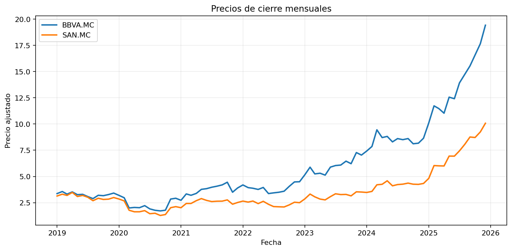
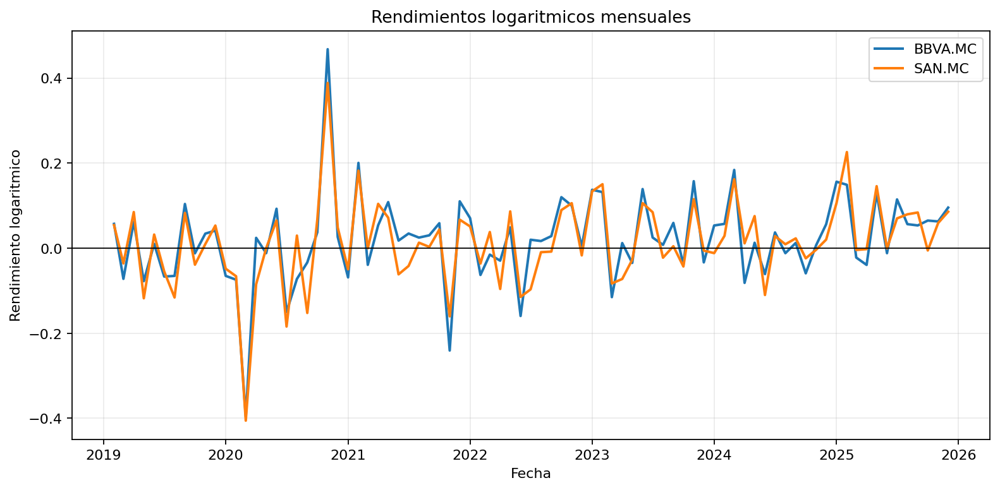
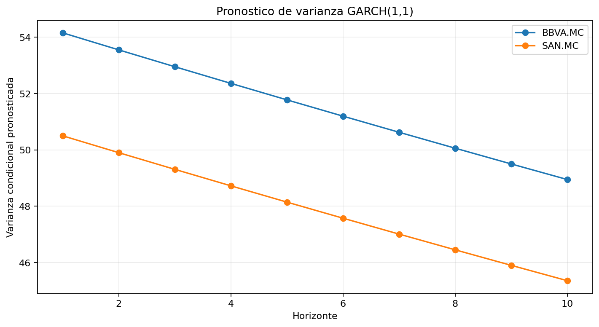
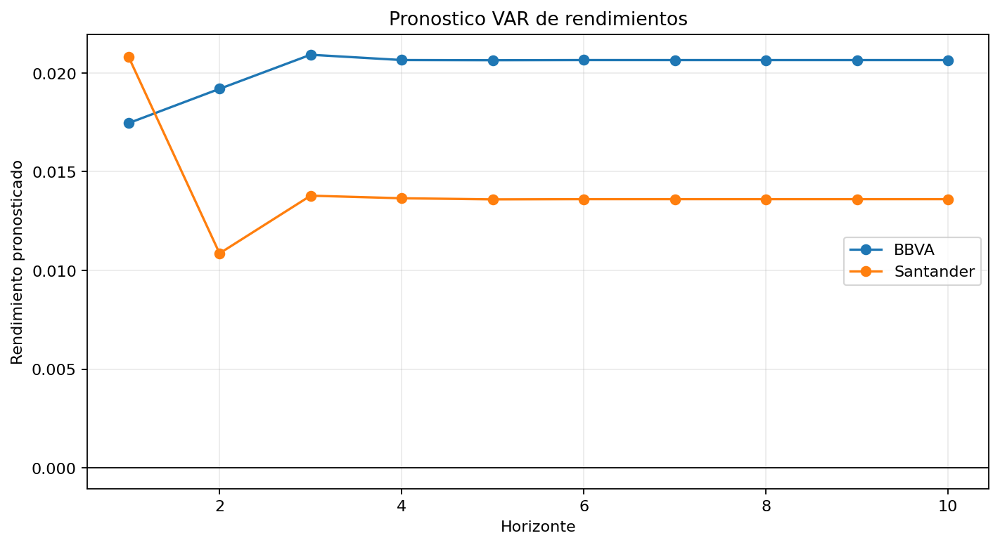
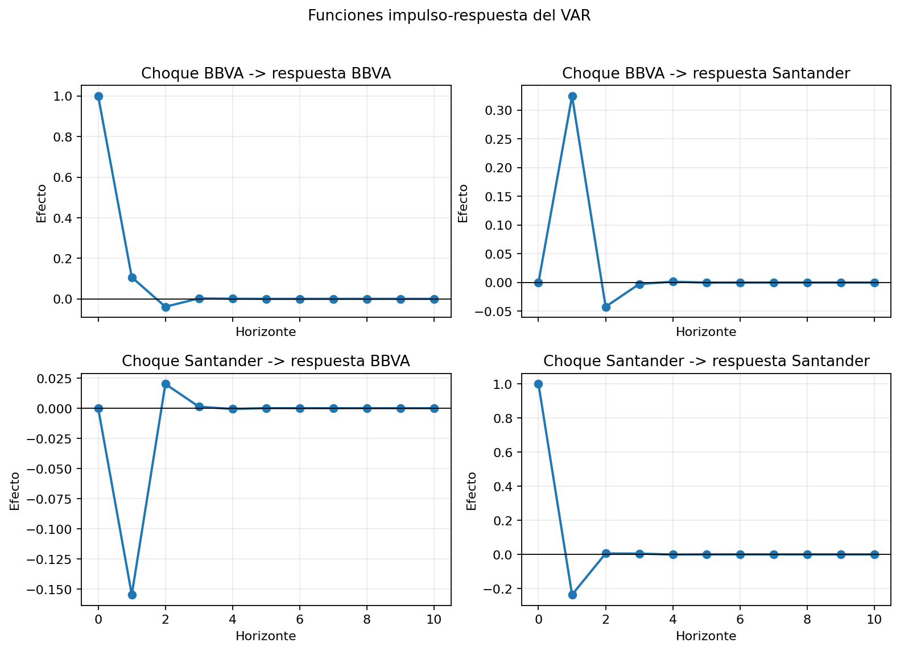

# Financial Time Series Econometrics in Python

[](https://github.com/islazybro/financial-time-series-econometric/actions/workflows/tests.yml)

Proyecto de econometria financiera en Python para analizar las acciones de **BBVA** y **Banco Santander** en el mercado espanol mediante pruebas de estacionariedad, modelos ARIMA, volatilidad GARCH y modelos VAR.

El proyecto original fue desarrollado en R como trabajo academico. Esta version lo reconstruye desde cero con una estructura reproducible, documentacion tecnica y una narrativa pensada para GitHub y portafolio profesional.

## Resumen

El analisis usa precios mensuales descargados desde Yahoo Finance:

- BBVA: `BBVA.MC`
- Santander: `SAN.MC`
- Periodo: 2019-01-01 a 2026-01-01
- Frecuencia: mensual
- Observaciones validas: 84 por serie

Preguntas principales:

1. Los precios son estacionarios o requieren transformacion.
2. Que modelo ARIMA describe la dinamica de la media.
3. Existe persistencia en la volatilidad mediante GARCH.
4. Hay relacion dinamica entre ambas series mediante VAR, Granger e impulso-respuesta.

## Resultados Principales

- Los precios en niveles no son estacionarios segun ADF.
- Los rendimientos logaritmicos son estacionarios.
- El modelo seleccionado por AIC para ambas series fue `ARIMA(0, 2, 1)`.
- El modelo `GARCH(1,1)` muestra alta persistencia en la volatilidad.
- El `VAR(1)` no encuentra evidencia significativa de causalidad de Granger entre BBVA y Santander.
- Las funciones impulso-respuesta sugieren que los choques tienen efectos transitorios.

La interpretacion completa esta en [docs/results-interpretation.md](docs/results-interpretation.md).

## Visualizaciones

### Precios de cierre



### Rendimientos logaritmicos



### Pronostico de varianza GARCH



### Pronostico VAR



### Impulso-respuesta



## Metodologia

El flujo del proyecto es:

1. Descarga de precios desde Yahoo Finance.
2. Validacion y limpieza de datos.
3. Calculo de rendimientos logaritmicos.
4. Pruebas ADF de raiz unitaria.
5. Seleccion ARIMA por AIC.
6. Pruebas ARCH y estimacion GARCH.
7. Estimacion VAR sobre rendimientos.
8. Causalidad de Granger, pronostico e impulso-respuesta.
9. Generacion de reporte y visualizaciones.

La explicacion metodologica esta en [docs/methodology.md](docs/methodology.md).

## Estructura

```text
.
|-- config
|   `-- data_sources.json
|-- data
|   `-- raw
|-- docs
|   |-- figures
|   |-- methodology.md
|   |-- results-interpretation.md
|   `-- market-selection.md
|-- outputs
|-- scripts
|   |-- download_prices.py
|   |-- generate_figures.py
|   |-- run_analysis.py
|   |-- run_pipeline.py
|   `-- validate_data.py
`-- src
    `-- econometria_financiera
```

## Instalacion

```bash
python -m venv .venv
.venv\Scripts\activate
pip install -e .
```

## Reproducir El Analisis

Ejecutar todo el flujo:

```bash
python scripts/run_pipeline.py
```

Si ya tienes los CSV en `data/raw/`, puedes omitir la descarga:

```bash
python scripts/run_pipeline.py --skip-download
```

Descargar datos:

```bash
python scripts/download_prices.py
```

Validar datos:

```bash
python scripts/validate_data.py
```

Ejecutar analisis:

```bash
python scripts/run_analysis.py
```

Generar visualizaciones:

```bash
python scripts/generate_figures.py
```

Los resultados tecnicos se guardan en `outputs/`. Las graficas versionables se guardan en `docs/figures/`.

Ejecutar pruebas:

```bash
pip install -e ".[dev]"
pytest
```

## Documentacion

- [Construccion paso a paso](docs/build-step-by-step.md)
- [Datos y validacion](docs/data-step.md)
- [Seleccion de mercado y tickers](docs/market-selection.md)
- [Metodologia](docs/methodology.md)
- [Interpretacion de resultados](docs/results-interpretation.md)
- [Limitaciones y alcance](docs/limitations.md)
- [Pipeline completo](docs/pipeline.md)
- [Pruebas y checks](docs/testing.md)
- [Texto para CV y LinkedIn](docs/cv-project-entry.md)
- [Revision final para reclutadores](docs/recruiter-review.md)

## Tecnologias

- Python
- Pandas
- NumPy
- Statsmodels
- ARCH
- Matplotlib
- yfinance

## Valor Para Portafolio

Este repositorio muestra capacidad para transformar un trabajo academico en un proyecto reproducible de analisis de datos: estructura modular, descarga automatizada, validacion de datos, modelado econometrico, visualizacion, interpretacion y documentacion clara.

## Licencia

Este proyecto se publica bajo licencia MIT. Consulta [LICENSE](LICENSE).
