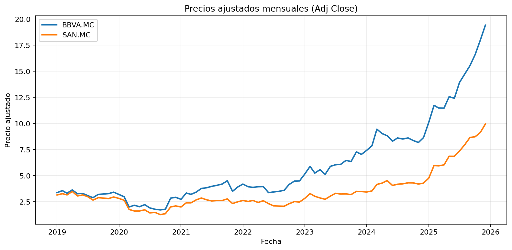
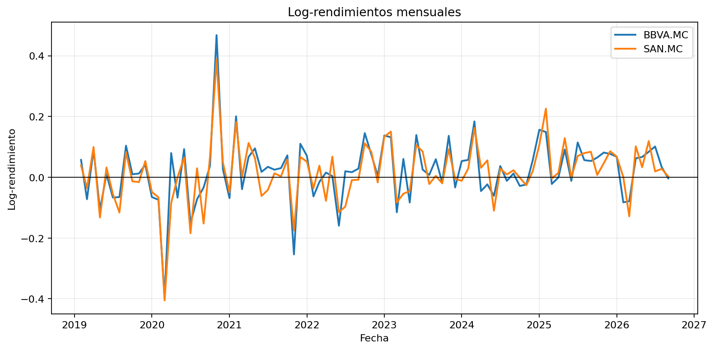
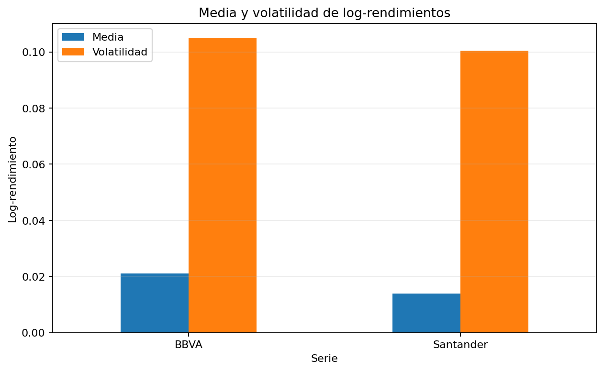
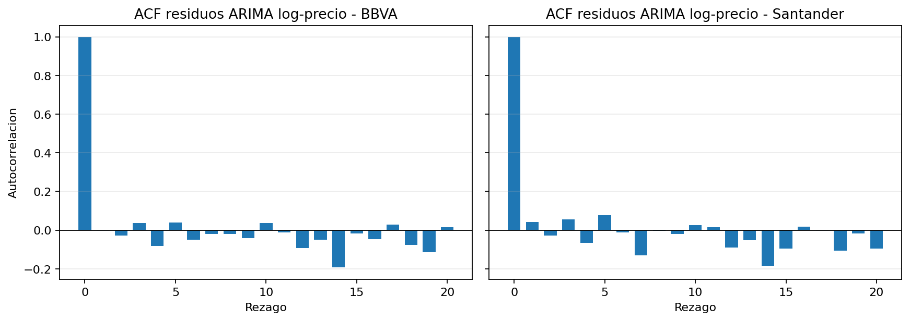
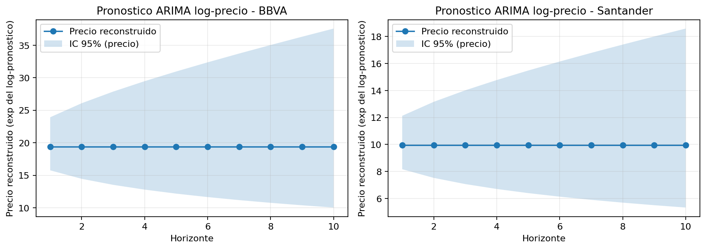
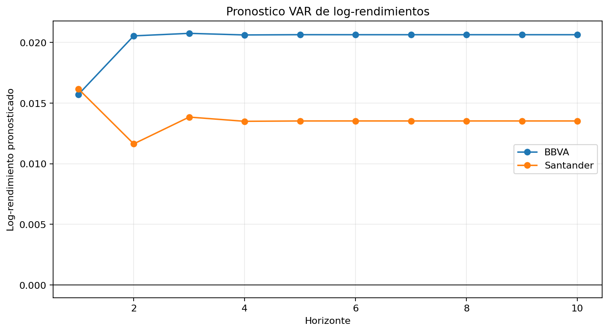
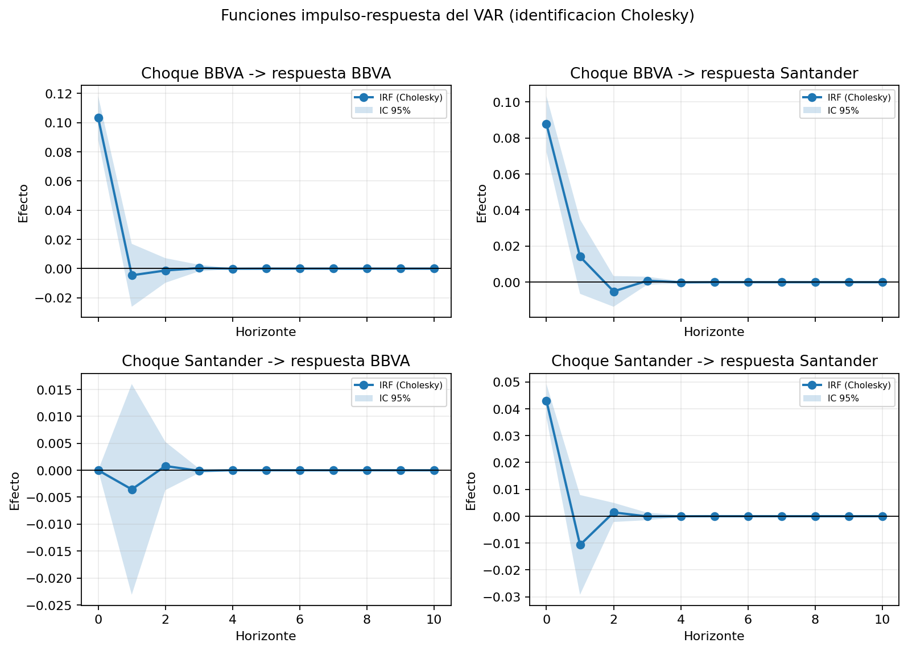

# Financial Time Series Econometrics in Python

[](https://github.com/islazybro/financial-time-series-econometric/actions/workflows/tests.yml)

Proyecto de econometria financiera en Python para analizar las acciones de **BBVA** y **Banco Santander** en el mercado espanol. Cubre pruebas de estacionariedad (ADF y KPSS), modelos ARIMA sobre log-precios, analisis de volatilidad (ARCH-LM y GARCH condicional), modelos VAR con diagnostico de residuos, causalidad de Granger e impulso-respuesta.

El proyecto original fue desarrollado en R como trabajo academico. Esta version lo reconstruye con una estructura reproducible, documentacion tecnica y un pipeline configurable.

## Objetivo

Responder, con evidencia estadistica:

1. Si los log-precios son estacionarios o requieren diferenciacion.
2. Que modelo ARIMA describe la dinamica de la media.
3. Si existe evidencia de heterocedasticidad condicional (efectos ARCH).
4. Si hay relacion dinamica entre ambas series mediante VAR, Granger e impulso-respuesta.

## Datos

| Elemento | Valor |
| --- | --- |
| BBVA | `BBVA.MC` |
| Santander | `SAN.MC` |
| Fuente | Yahoo Finance (via `yfinance`) |
| Campo de precio | precio ajustado (`Adj Close`) |
| Periodo | 2019-01-01 a 2025-12-01 (config `end`: 2026-01-01) |
| Frecuencia | mensual (`1mo`) |
| Observaciones por serie | 84 precios, 83 log-rendimientos |

Los activos y el periodo se configuran en `config/data_sources.json`. Los CSV reales no se versionan (ver `.gitignore`); se incluyen ejemplos `.csv.example`.

> Nota de reproducibilidad: Yahoo Finance puede revisar el historico de `Adj Close`. Los resultados corresponden a la ejecucion actual; una nueva descarga podria cambiar ligeramente las cifras. El reporte generado incluye la fecha de snapshot.

## Metodologia

El pipeline sigue este flujo:

```text
precio ajustado (Adj Close)  -> analisis descriptivo y visualizacion
log-precio                   -> estacionariedad (ADF/KPSS) y ARIMA de la media
log-rendimiento (dlog)       -> volatilidad (ARCH-LM/GARCH) y VAR
```

1. Descarga de precios desde Yahoo Finance y validacion de los datos.
2. Log-precio y log-rendimientos.
3. Estacionariedad con **ADF** (H0: raiz unitaria) y **KPSS** (H0: estacionariedad), reportadas por separado.
4. **ARIMA** sobre log-precios: `d` se determina con ADF; con `d` fijo, `p` y `q` se eligen por AIC (se reporta BIC). El pronostico se genera en log-precio y se transforma a precio.
5. **ARCH-LM** sobre residuos de media constante de los log-rendimientos; **GARCH(1,1)** solo si hay efectos ARCH.
6. **VAR** sobre log-rendimientos: seleccion de rezagos por AIC, estabilidad (raices del companion), Portmanteau, ARCH-LM por ecuacion y normalidad como diagnostico.
7. **Causalidad de Granger** (H0 y conclusion) e **impulso-respuesta** con identificacion Cholesky (orden BBVA -> Santander) y bandas al 95%.
8. Generacion de reporte (`outputs/analysis_report.md`), CSV y figuras.

Metodologia detallada en [docs/methodology.md](docs/methodology.md).

## Resultados principales

Corresponden a la ejecucion actual. Consulta el reporte generado para el detalle.

Estacionariedad:

| Serie | ADF log-precio (H0: raiz unitaria) | KPSS log-precio (H0: estacionariedad) | ADF log-rend. | KPSS log-rend. |
| --- | --- | --- | --- | --- |
| BBVA | p=0.9909 (no rechaza) | p=0.0100 (rechaza) | p≈0 (rechaza) | p=0.0929 (no rechaza) |
| Santander | p=0.9892 (no rechaza) | p=0.0100 (rechaza) | p≈0 (rechaza) | p=0.0455 (rechaza) |

Salvedad: en Santander, el ADF y el KPSS sobre rendimientos son **discordantes** (ADF rechaza raiz unitaria y KPSS rechaza estacionariedad al 5%). Se reporta sin forzar una clasificacion automatica.

ARIMA (log-precio):

| Serie | Modelo | AIC | BIC | Ljung-Box (lag 10) |
| --- | --- | --- | --- | --- |
| BBVA | ARIMA(0, 1, 0) | -134.2643 | -131.8455 | 0.9986 |
| Santander | ARIMA(0, 1, 0) | -143.3007 | -140.8818 | 0.9714 |

El AIC/BIC no es comparable entre representaciones distintas (precio bruto vs log-precio).

Volatilidad:

- ARCH-LM (media constante): BBVA p=0.961; Santander p=0.907.
- No hay evidencia de efectos ARCH, por lo que **GARCH(1,1) no se estima**.

VAR y dinamica conjunta:

- VAR(1) seleccionado por AIC: AIC=-10.6948, BIC=-10.5187, HQIC=-10.6241, FPE=2.27e-05.
- Sistema estable (raices del companion con |z| ≈ 7.27 > 1).
- Portmanteau (10 rezagos): p=0.5512 (sin autocorrelacion residual).
- Normalidad multivariante: p≈0 (diagnostico descriptivo, no condicion de validez).
- Correlacion contemporanea de log-rendimientos: 0.8853 (descriptiva, no causal).
- Granger: BBVA -> Santander p=0.2166; Santander -> BBVA p=0.8160 (sin evidencia de causalidad predictiva).
- Impulso-respuesta Cholesky (orden BBVA -> Santander): efectos pequenos y transitorios; los intervalos al 95% de las respuestas cruzadas incluyen 0.

## Visualizaciones

### Precios ajustados



### Log-rendimientos



### Comparativo de log-rendimientos



### Diagnostico ARIMA (ACF de residuos)



### Pronostico ARIMA (precio reconstruido)



### Pronostico VAR



### Impulso-respuesta (Cholesky, IC 95%)



## Estructura

```text
.
|-- config
|   `-- data_sources.json
|-- data
|   `-- raw
|-- docs
|   |-- figures
|   |-- methodology.md
|   |-- results-interpretation.md
|   |-- data-step.md
|   |-- pipeline.md
|   |-- limitations.md
|   `-- testing.md
|-- scripts
|   |-- download_prices.py
|   |-- validate_data.py
|   |-- run_analysis.py
|   |-- generate_figures.py
|   |-- generate_demo_data.py
|   `-- run_pipeline.py
|-- src
|   `-- econometria_financiera
|       |-- data.py
|       |-- io.py
|       |-- project_config.py
|       |-- reporting.py
|       |-- univariate.py
|       |-- volatility.py
|       |-- multivariate.py
|       `-- validation.py
|-- tests
`-- outputs            # generado, no versionado
```

## Instalacion

```bash
python -m venv .venv
.venv\Scripts\activate
pip install -e .
```

## Reproducir el analisis

Ejecutar todo el flujo:

```bash
python scripts/run_pipeline.py
```

Si ya tienes los CSV en `data/raw/`, puedes omitir la descarga:

```bash
python scripts/run_pipeline.py --skip-download
```

Por etapas:

```bash
python scripts/download_prices.py
python scripts/validate_data.py
python scripts/run_analysis.py
python scripts/generate_figures.py
```

Salidas:

- `outputs/`: `analysis_report.md` y CSV (no versionados).
- `docs/figures/`: figuras versionadas para GitHub.

Los pronosticos univariados usan nombres derivados del ticker (`bbva_mc_arima_forecast.csv`, `san_mc_arima_forecast.csv`) y exponen el pronostico en log-precio (`mean_log`) y en precio reconstruido (`mean_price`).

## Tests

```bash
pip install -e ".[dev]"
pytest
```

Referencia actual: **15 tests** que cubren carga y validacion de datos, log-precios, seleccion de `d`, KPSS, configuracion e IO. Detalle en [docs/testing.md](docs/testing.md).

## Reproducibilidad

- Los modelos son deterministas; el demo usa semillas fijas.
- La configuracion de tickers, periodo y frecuencia vive en `config/data_sources.json`.
- Las rutas se resuelven contra la raiz del proyecto.
- El reporte generado incluye fuente, campo de precio, periodo y fecha de snapshot.
- Las cifras de este README y de `docs/` provienen de la ejecucion actual; si Yahoo Finance revisa los datos, pueden cambiar.

## Limitaciones

- La frecuencia mensual y 84 observaciones limitan conclusiones fuertes.
- Los modelos son sensibles a especificacion, rezagos y periodo muestral.
- ADF y KPSS pueden discrepar (caso Santander en rendimientos); no se aplica una regla automatica.
- La causalidad de Granger es predictiva, no causalidad economica.
- El analisis no incorpora variables macroeconomicas ni fundamentales.
- No constituye recomendacion de inversion. Ver [docs/limitations.md](docs/limitations.md).

## Tecnologias

- Python
- Pandas
- NumPy
- Statsmodels (ADF, KPSS, ARIMA, VAR)
- ARCH (GARCH, cuando aplica)
- Matplotlib
- yfinance

## Documentacion

- [Datos y validacion](docs/data-step.md)
- [Seleccion de mercado y tickers](docs/market-selection.md)
- [Metodologia](docs/methodology.md)
- [Interpretacion de resultados](docs/results-interpretation.md)
- [Limitaciones y alcance](docs/limitations.md)
- [Pipeline completo](docs/pipeline.md)
- [Pruebas y checks](docs/testing.md)

## Licencia

Este proyecto se publica bajo licencia MIT. Consulta [LICENSE](LICENSE).
